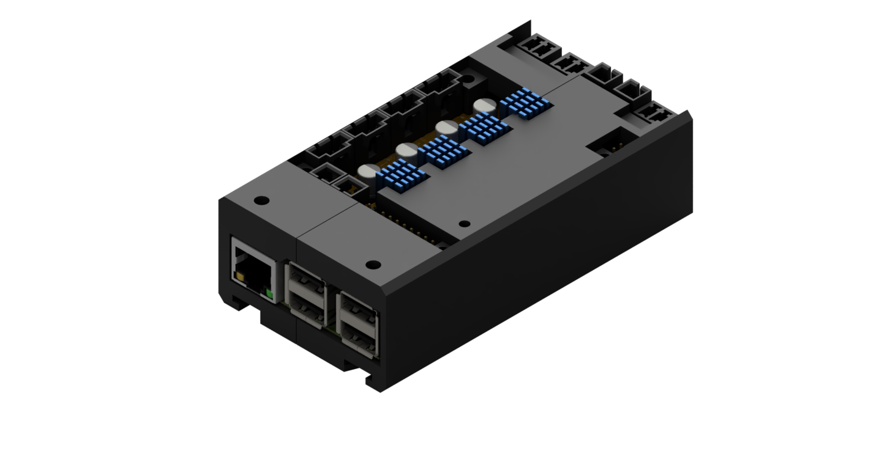
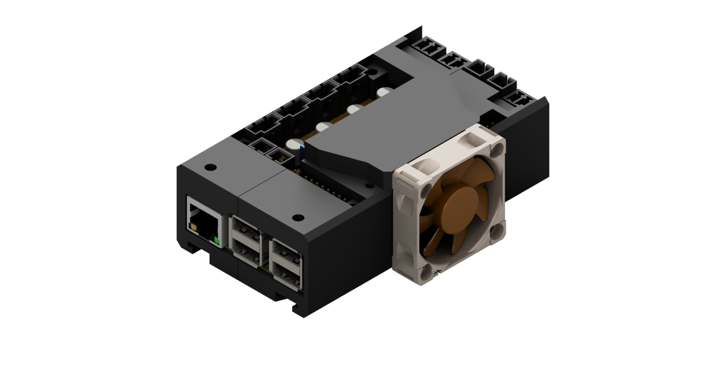
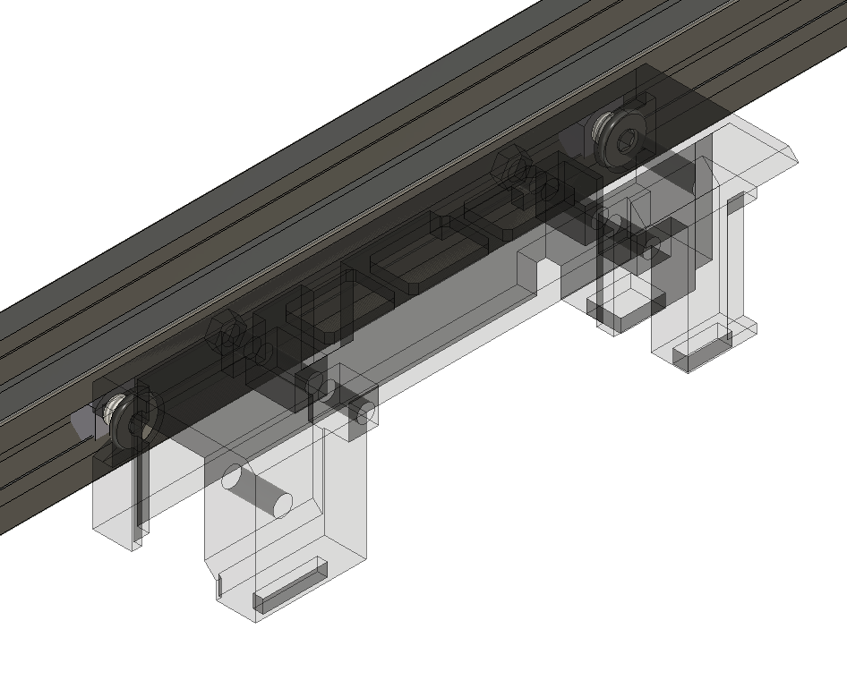
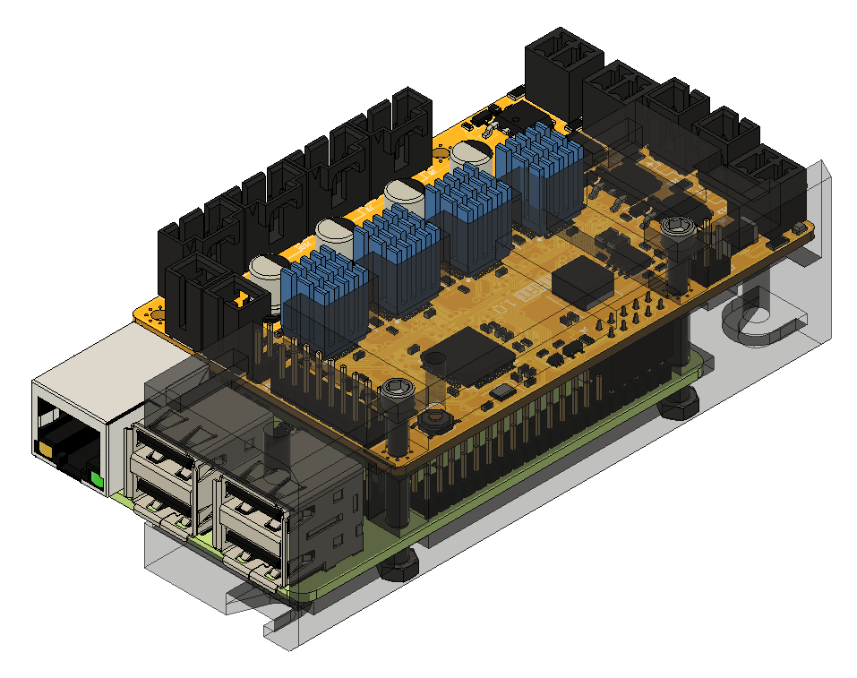
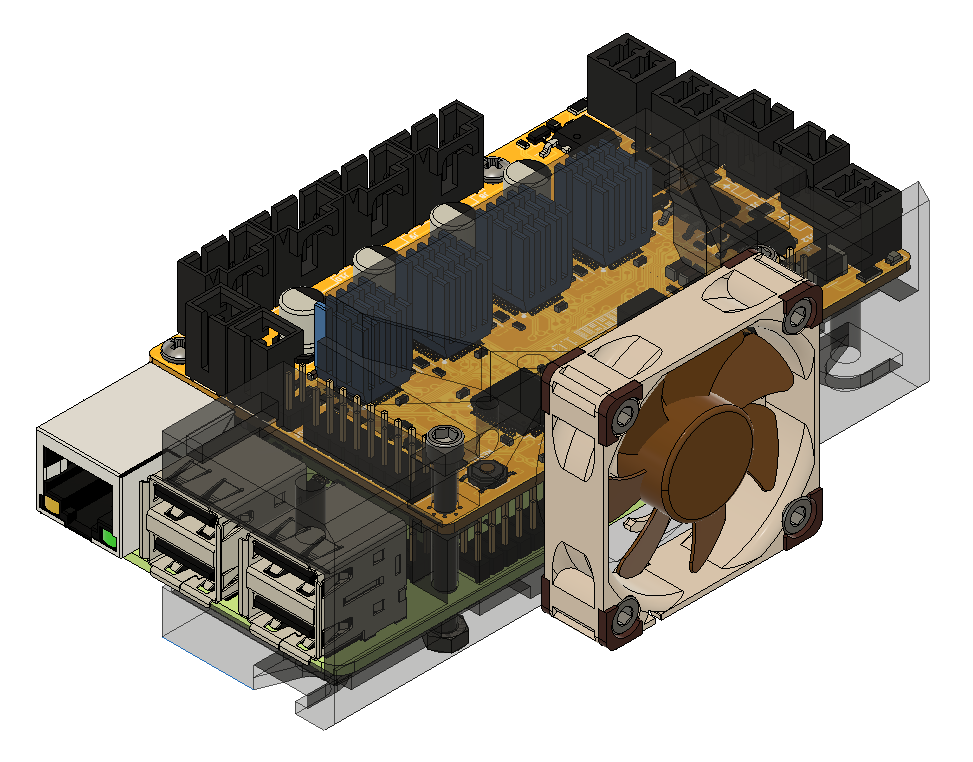
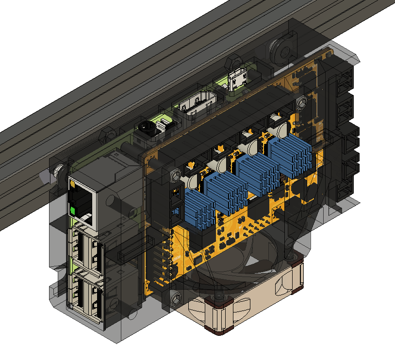

# Enclosures for printHAT 1

The printHAT enclosure is designed to accomodate the board and the Raspberry Pi. It is composed of two, easily 3D printable, halves and supports the installation on slotted modular frames (OpenBuilds, Misumi, Bosch). It comes in two flavors: with and without cooling fan.

| Natural cooling  | Forced cooling |
|:-------------------------:|:-------:|
| |  |
|[Download](https://github.com/wreck-lab/wrecklabOS/tree/devel/printHAT%201/cad/enclosures){:target="_blank"} | [Download](https://github.com/wreck-lab/wrecklabOS/tree/devel/printHAT%201/cad/enclosures){:target="_blank"} |

The forced cooling version is particularly indicated for all those applications where maximum performance of the drivers is needed, either because of high printing speed or because of big motors with high motor current.  
We recommend the use of one of the following fans:
* [Noctua NF-A4x10 5V](https://noctua.at/en/products/fan/nf-a4x10-5v), 40x40x10 mm size, 5V power supply
* [Noctua NF-A4x20 5V](https://noctua.at/en/products/fan/nf-a4x20-5v), 40x40x20 mm size, 5V power supply, for even greater flow

Enclosure and fan are assembled using the following fasteners  

| Qty | Article | Note |
|:---:|:---:|:---:|
| 4 | DIN912 M3x30 screw | enclosure to board  |
| 4 | M3 nut  | enclosure to board  |
| 4 | DIN912 M3x10 screw  | optional, 10mm fan  |
| 4 | DIN912 M3x20 screw  | optional, 20mm fan  |
| 2 | M5x8 screw  | enclosure to frame |
| 2 | M5 T-nut | enclosure to frame |

# Installation
To mount the enclosure onto a frame, the top half of the enclosure has to be installed first, using the M5x8 screws and T-nuts (Fig.1), and running the Allen key through the dedicated holes on the part.

Then take the bottom half of the enclosure and the assembled printHAT 1 and Raspberry Pi and slide them together (Fig.2). The enclosure features internal slots to support the boards with no need for additional stand-off.  
Make sure the boards slide all the way in, so that the mounting holes are aligned with the ones on the enclosure. Use two M3x30 screws and M3 nuts to secure boards and cover together.
If you're assembling the forced cooling version mount the fan using four M3x10 screws (Fig.3).

Put together the two parts sliding the bottom assembly inside the top part mounted on the frame (Fig.4). Use two M3x30 screws and M3 nuts to secure boards and top part together.  
That's all.

*Fig.1 - Installation of the top-half case to the frame*

*Fig.2 - Slide printHAT 1 and Raspberry into the bottom-half of the enclosure*

*Fig.3 - Installation of the cooling fan*

*Fig.4 - Enclosure fully installed*
