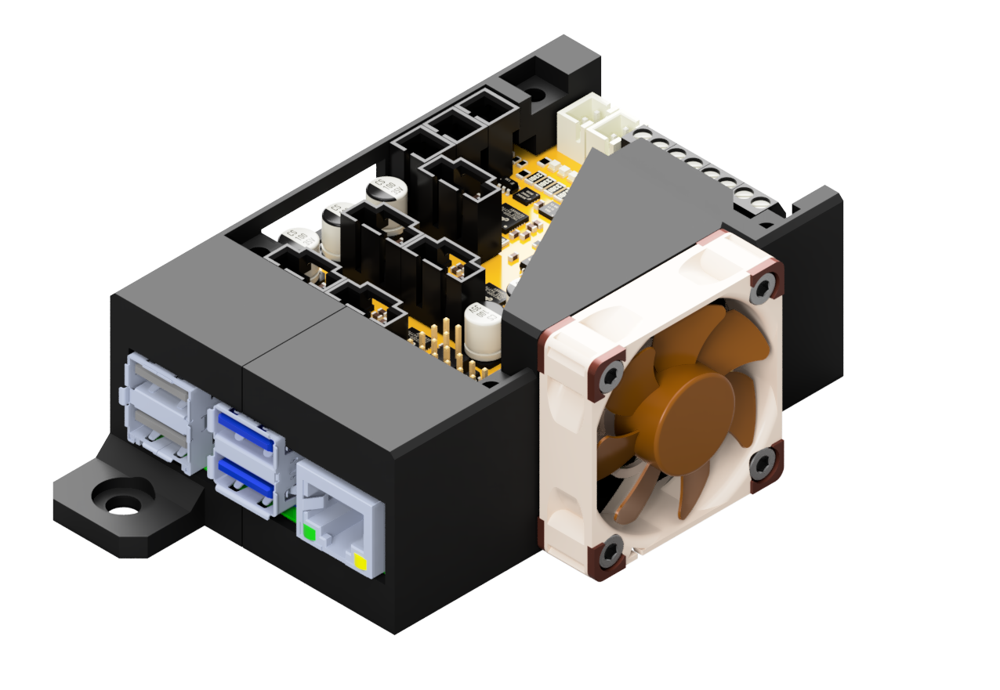

# Enclosures for printHAT 2

The printHAT 2 enclosure, as the printHAT 1's, is composed of two halves designed with 3D printability in mind (no supports required) and features two external mounting holes for easier installation on slotted modular frames (OpenBuilds, Misumi, Bosch).  
As its predecessor, comes in two flavours, one intended for natural cooling and the other with support for a cooling fan.

| Natural cooling  | Forced cooling |
|:-------------------------:|:-------:|
| |  |
|[Download](https://github.com/wreck-lab/wrecklabOS/tree/devel/printHAT%202/cad/enclosures){:target="_blank"} | [Download](https://github.com/wreck-lab/wrecklabOS/tree/devel/printHAT%202/cad/enclosures){:target="_blank"} |

*Fig.1 - Build plate arrangement to print the enclosure parts without supports*

# Material

Enclosure (and fan) use the following fasteners.

| Qty | Article | Note |
|:---:|:---:|:---:|
| 4 | DIN912 M3x30 screw | enclosure to board  |
| 4 | M3 nut  | enclosure to board  |
| 4 | DIN912 M3x10 screw  | optional, 10mm fan  |
| 4 | DIN912 M3x20 screw  | optional, 20mm fan  |
| 2 | M5x8 screw  | enclosure to frame |
| 2 | M5 T-nut | enclosure to frame |

We recommend the use of one of the following fans:
* [Noctua NF-A4x10 5V](https://noctua.at/en/products/fan/nf-a4x10-5v), 40x40x10 mm size, 5V power supply
* [Noctua NF-A4x20 5V](https://noctua.at/en/products/fan/nf-a4x20-5v), 40x40x20 mm size, 5V power supply, for even greater flow

# Installation
Start with the assembled printHAT 2 and Raspberry Pi, and slide it into  the bottom part of the enclosure. The enclosure features internal slots to support the boards with no need for additional stand-off (Fig. ).  
Use two M3x30 screws and M3 nuts to secure boards and enclosure bottom part together.

> **ALIGNMENT**   
Make sure the boards slide all the way in, so that the mounting holes are aligned with the ones on the enclosure.

> **COOLING**  
If you're assembling the forced cooling version mount the fan using four M3x10 screws (Fig.3).

Slide the enclosure top part onto the assembly and secure it using the other two M3x30 screws and M3 nuts to together.  

> **BOOT JUMPER**  
Make sure that the boot jumper has been removed from the board.

Use the M5x8 screws and T-nuts (Fig. ), to fix the enclosure onto the frame rail.
