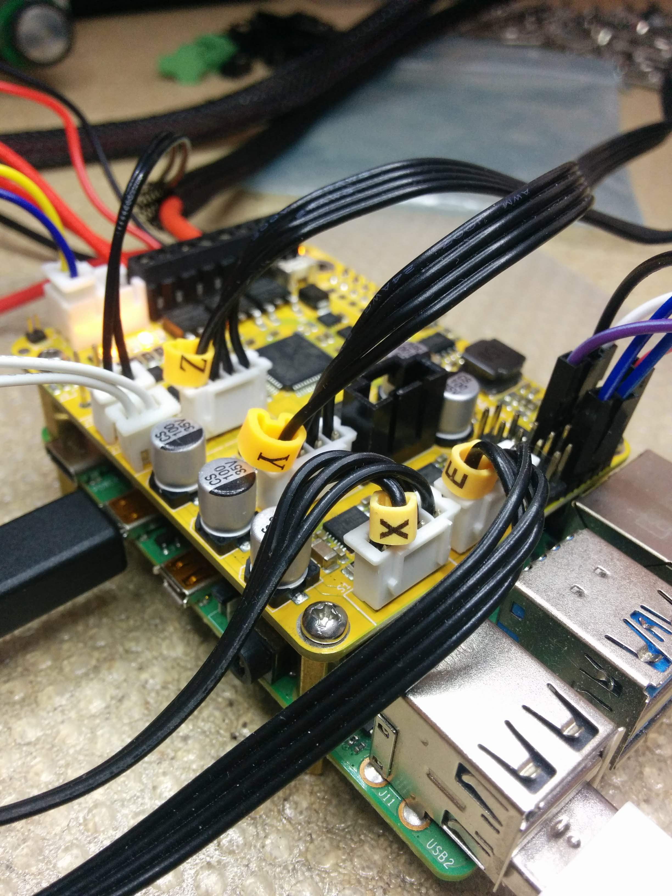
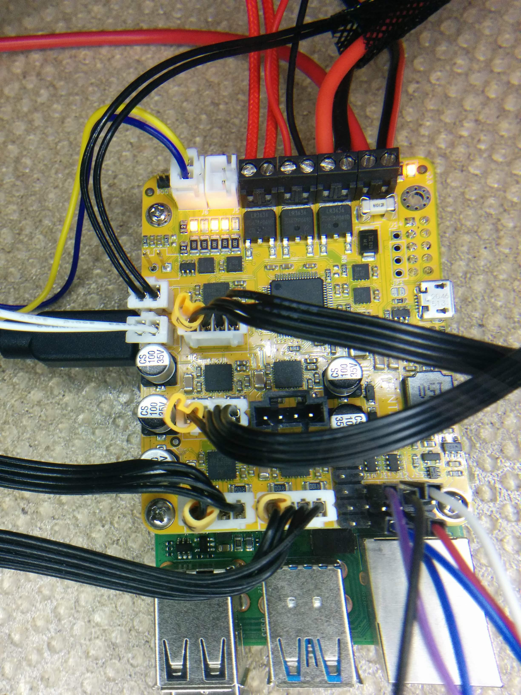

The printHAT board has been designed with 3D printing applications in mind and it can be used to power your custom build or to retrofit commercially available printers.

## Ender 3 (printHAT 1)
If you own a Creality Ender 3 and a printHAT 1 you can refer to [Teaching Tech tutorial](https://www.youtube.com/watch?v=5bIzcA8PBgY){:target="_blank"} for a walkthrough on how to set up the board on your machine.

## Ender 3 (printHAT 2)
If you own a Creality Ender 3 and a printHAT 2 you can take advantage of the [Ender 3 configuration file](https://github.com/wreck-lab/wrecklabOS/blob/devel/src/modules/klipper/filesystem/home/pi/klipper_config/config/printer-creality-ender3-phat2.cfg) to jump start your retrofit. Copy the content of the file into the Klipper printer.cfg.
Then remove the original control board and screen (not needed anymore) and rewire the printer following the [printHAT 2 reference pinout](phat2/connections) and the notes below.

> **CONNECTORS**  
Connect the **stepper motors** to S1-S4 using the original Ender cables, but removing the shroud from the board connectors.  
Connect the **thermistors** to J7-J8 using the original cables, but removing the shroud from the board connectors.  
Connect the **endstops** to J10-J12 replacing the original cable connectors for plain female headers, and connecting then SIGNAL and GND pins as shown in (Fig.2).  
Connect the **hotend fan** to J3 using the original
Connect the **print cooling fan** to J6 using the original cable and connector to J6.

> **POWER CABLES**  
Taper the power supply and bed wires to facilitate the insertion into the screw terminals.

*Fig.1 Correct order and orientation of the stepper motor cables on the printHAT connectors (without shrouds)*

*Fig.2 Overview of the completed rewiring of the Ender 3*
