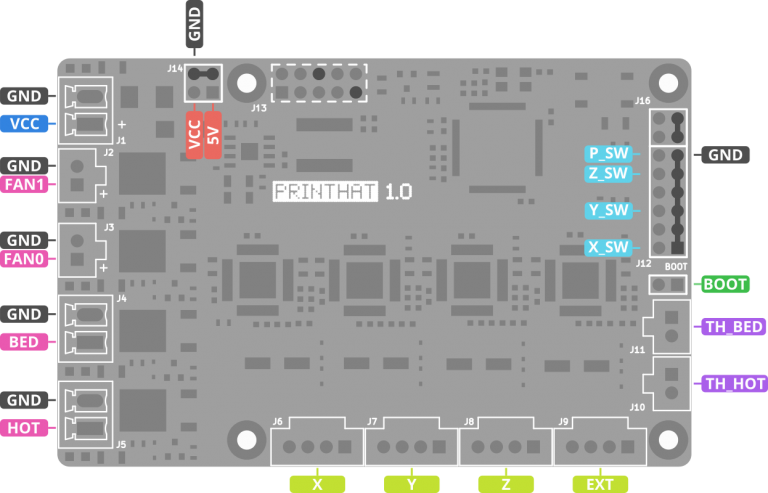
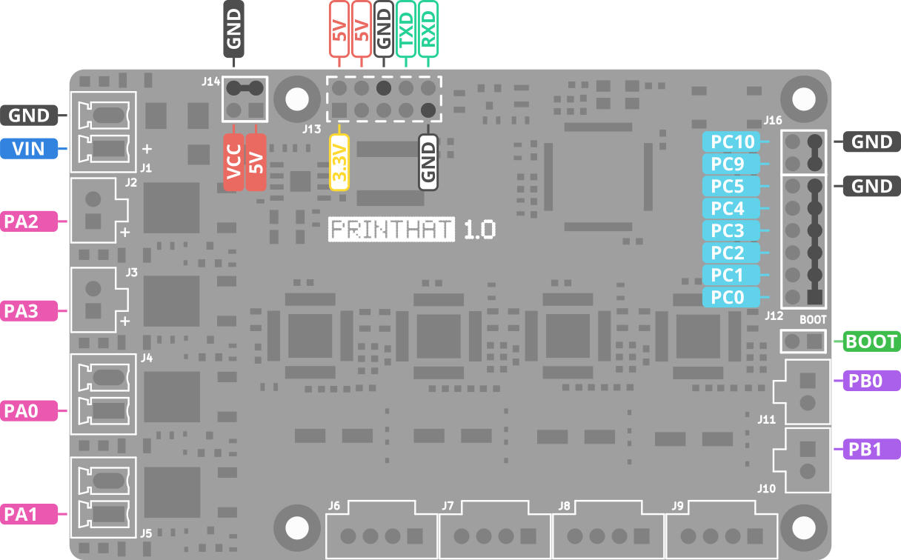

Next, install the printHAT 1 and the Raspberry Pi on your 3D printer and connect the cables according to the diagram below.  
For the installation, you can use the original Wrecklab [enclosure](../cad/enclosure_phat1).  

>**NOTE**  
The nomenclature for the axis is the one adopted by Klipper (as well as other control software) where for a cartesian printer the motion axes are labeled X,Y,Z while for a delta printer the towers are labeled A,B,C. The extruder is called in both cases EXT.  

*Fig.1 - printHAT 1 pin assignment for cartesian printers*

*Fig.2 - printHAT 1 pin assignment for delta printers*

*Fig.3 - printHAT 1 microcontroller pin names*
