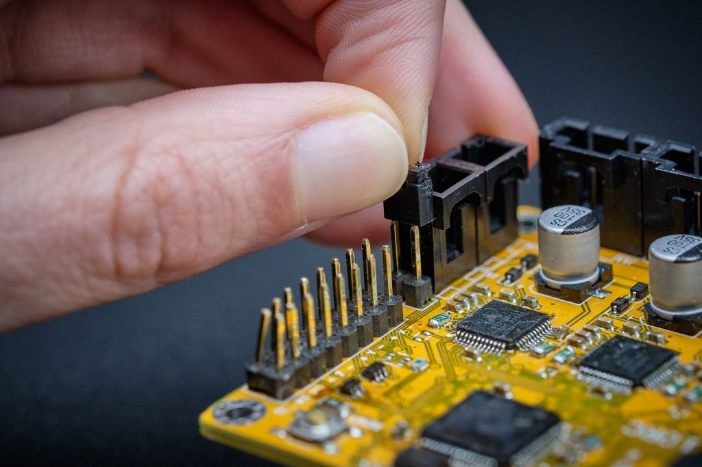

During the first boot the printHAT image takes care of installing all the required software. Connect the printHAT to the Raspberry Pi following the procedure:

1. Connect the board making sure that the printHAT connector is aligned with the right end of the Raspberry Pi header (see picture)
2. Mount the spacers as shown on the picture
3. Mount the jumper on the BOOT pins
4. Power the Raspberry PI via the Micro USB port with a suitable power supply
5. The initialization starts automatically and it takes a couple of minutes.
6. Upon completion the Raspberry Pi goes into shutdown and the ACT led stops blinking. Now it’s possible to power off the Raspberry Pi.
7. Remove the BOOT jumper

*Fig.1 - printHAT 1 and Raspberry Pi stack alignment*

*Fig.2 - printHAT 1 spacers installation*

*Fig.3 - printHAT 1 boot jumper location*
