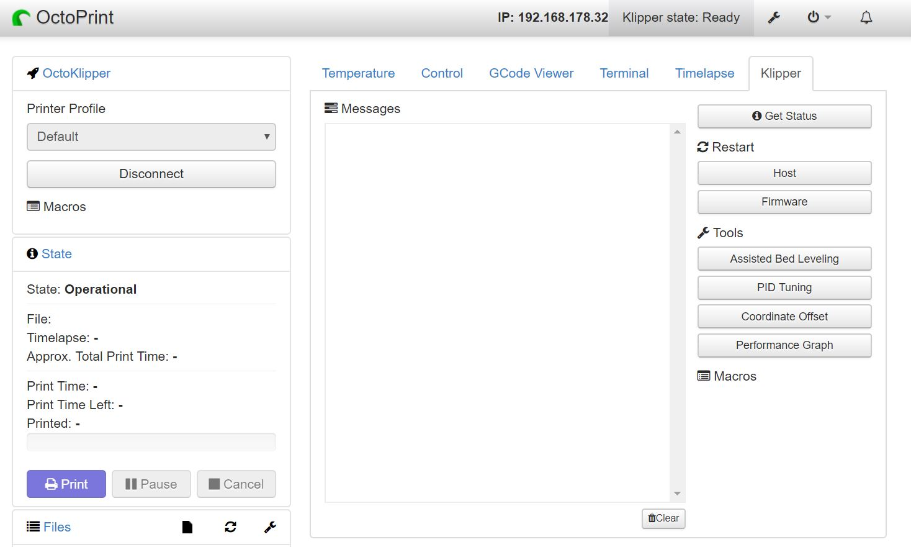

## Start the printer

With the printHAT 2 fully wired on the printer it's now time to power it up.

In a little while, you will be able to connected to OctoPrint as already done before, via [http://wrecklab.local/](http://wrecklab.local/){:target="_blank"}

Once on the web interface you can then Connect to the printer.

If the installation has been successful you will see the temperature log coming live. You can also check Klipper status issuing the STATUS command in the OctoPrint terminal.

> **IMPORTANT**  
When the printer is up and running it is advisable to **follow the Klipper configuration [check-list](https://github.com/KevinOConnor/klipper/blob/master/docs/Config_checks.md)** before attempting the first print.

