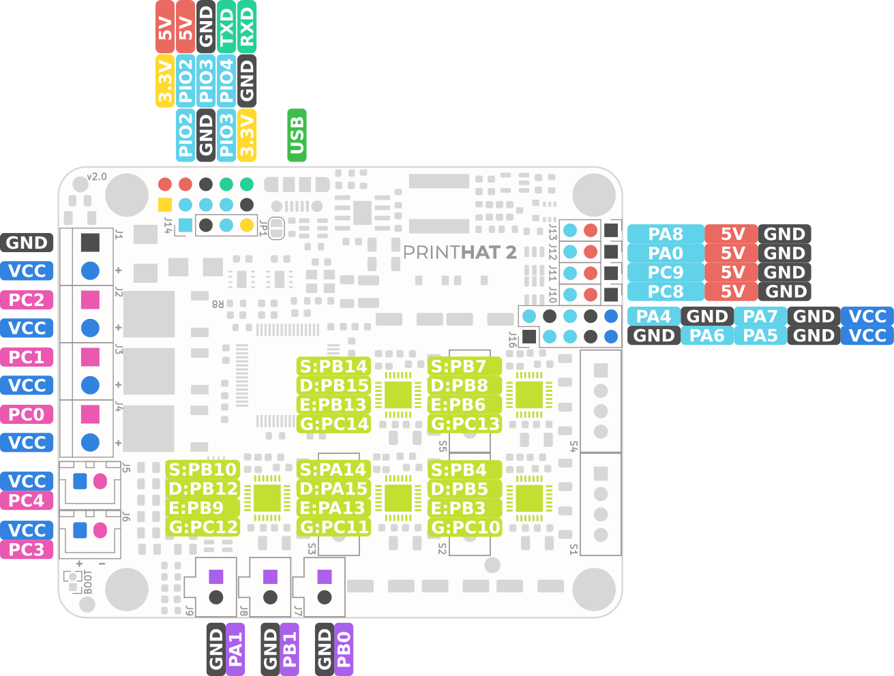
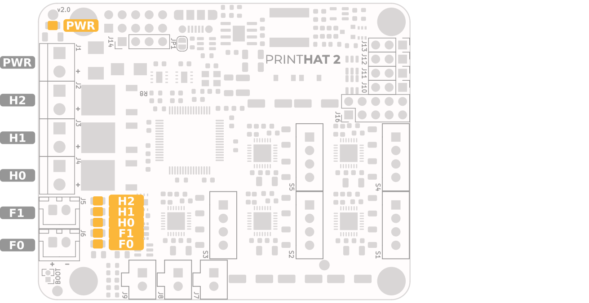

Next, install the printHAT 2 and the Raspberry Pi on your 3D printer and connect the cables according to the diagram below. Please note that the nomenclature for the axis is the one adopted by Klipper (as well as other control software) where for a cartesian printer the motion axes are labeled X,Y,Z while for a delta printer the towers are labeled A,B,C. The extruders are called in both cases E0, E2, etc.  
The connectors J1 through J4 are suitable for a wire size (AWG) 16 to 28 (0.20-1.00 mm²)

**PAY ATTENTION TO POLARITY FOR FANS AND INPUT POWER - VCC IS ALWAYS THE POSITIVE TERMINAL**  

*Fig.1 - printHAT 2 default pin assignment (GPx are the STM32F4 GPIO pins, PIOx are the Raspberry PI GPIO pins)*

*Fig.2 - printHAT 2 MCU GPIOs assignment (S:D:E:G: are stepper STEP, DIR, ENABLE and DIAG1 pin respectively, PIOx are the Raspberry PI GPIO pins)*

*Fig.3 - printHAT 2 onboard LEDs*
