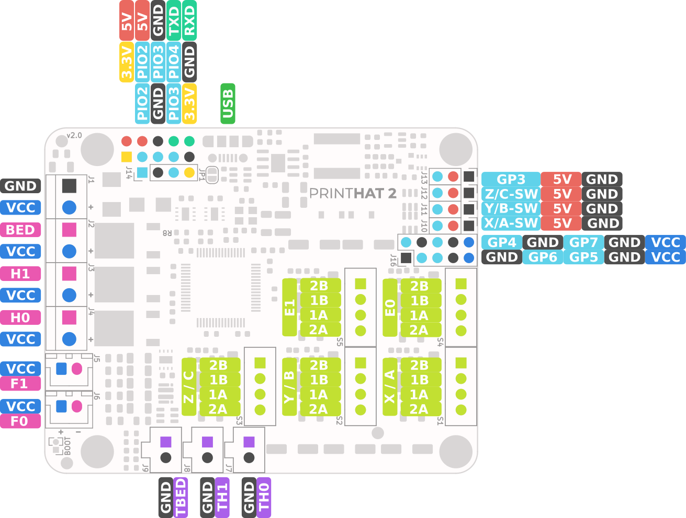

## Save configuration
After completing the Klipper configuration described in the previous pages, you can save the new settings by pressing the Save button at the bottom of the dialog box.  
Klipper will automatically restart to load the new settings.

> **NOTE**  
Klipper will report errors, in the Terminal and Status windows, because the printer is not wired yet. This is normal and you can safely proceed.

## Shutdown
You can then shut down the board and prepare for the installation on the printer.

> **IMPORTANT**   
Remember to always shutdown the system using the OctoPrint shutdown button on the top right corner of the interface (select Shutdown system) and wait until the green Raspberry Pi LED turns off.

## Printer installation
Install the printHAT 2 and the Raspberry Pi on your 3D printer and connect the cables according to the wiring diagram (Fig.1).  
Please note that the nomenclature for the axis is the one adopted by Klipper (as well as other control software) where for a cartesian printer the motion axes are labeled X,Y,Z while for a delta printer the towers are labeled A,B,C. The extruders are called in both cases E0, E1, etc.  

> **IMPORTANT**  
Mind the **polarity** for fans and input power connections, **Vcc is always the positive terminal**  

> **NOTE**  
The connectors J1 through J4 are suitable for a wire size (AWG) 16 to 28 (0.20-1.00 mm²)

*Fig.1 - printHAT 2 default pin assignment (GPx are the STM32F4 GPIO pins, PIOx are the Raspberry PI GPIO pins)*

*Fig.2 - printHAT 2 MCU GPIOs assignment (S:D:E:G: are stepper STEP, DIR, ENABLE and DIAG1 pin respectively, PIOx are the Raspberry PI GPIO pins)*

*Fig.3 - printHAT 2 onboard LEDs*
