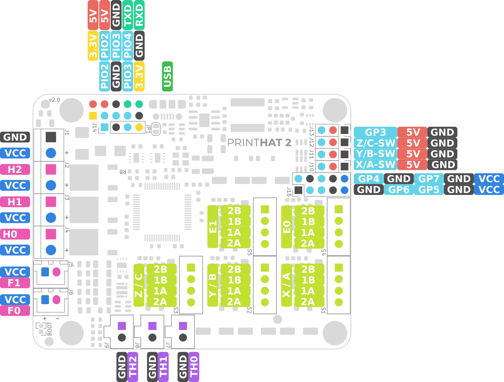

Next, install the printHAT 2 and the Raspberry Pi on your 3D printer and connect the cables according to the diagram below. Please note that the nomenclature for the axis is the one adopted by Klipper (as well as other control software) where for a cartesian printer the motion axes are labeled X,Y,Z while for a delta printer the towers are labeled A,B,C. The extruders are called in both cases E0, E2, etc.

