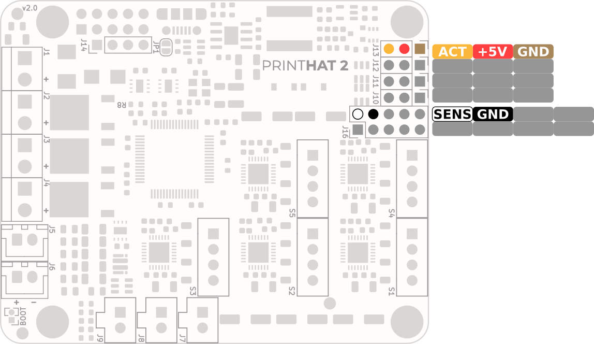
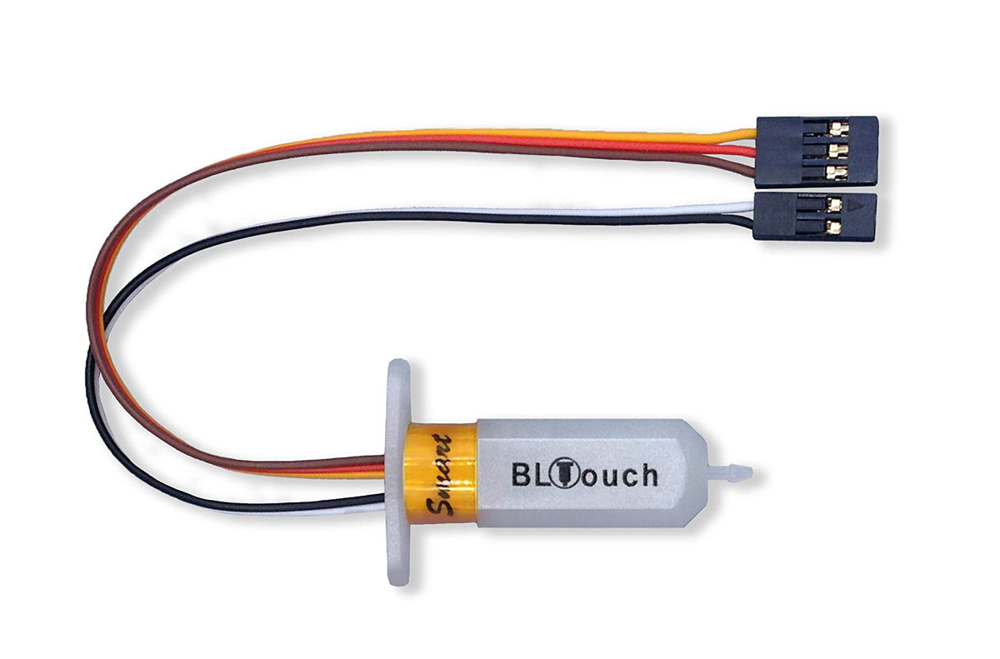

## Configure a BlTouch probe

### Wiring the probe
The printHAT 2 is designed to be compatible with the [Antclabs BlTouch probe](https://www.antclabs.com/bltouch-v3){:target="_blank"} out of the box, which means the pinout on the GPIO and expansion ports of board match the probe connnectors with no need fo swapping wires.
Plug a genuine BlTouch to the printHAT according to the picture below.





### Software configuration
Once the probe is wired to the printHAT, you can move on to modify the KLipper configuration file as follow:

- add the [bltouch] section
```py
[bltouch]
sensor_pin:
control_pin: PA8
```

- update the Z axis configuration and add [safe_z_home] section (optional, only if probe is used to home Z)
```py
endstop_pin: probe:z_virtual_endstop
```

```py
[safe_z_home]
home_xy_position: 100,100 # Change coordinates to the center of your print bed
speed: 50
z_hop: 10                 # Move up 10mm
z_hop_speed: 5
```  

In case of troubles, you can always have a look at the official [Klipper BlTouch documentation](https://www.klipper3d.org/BLTouch.html){:target="_blank"} or get in touch with us through one of the available [support channels](/).
