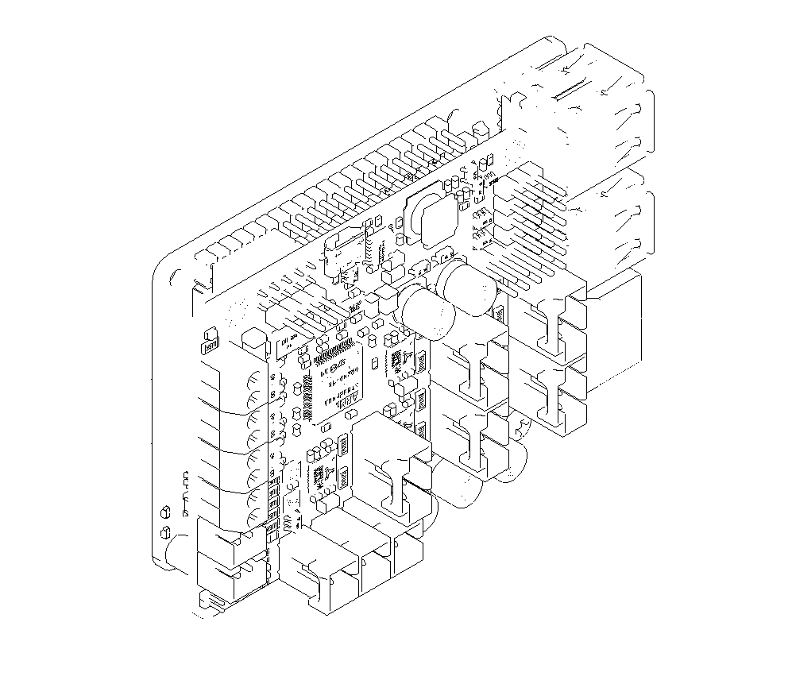
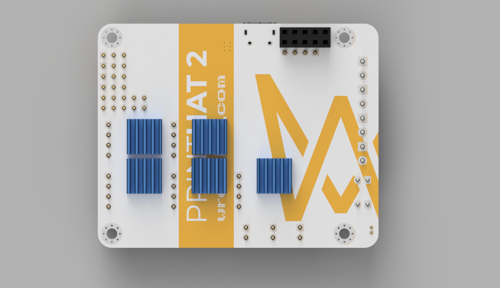
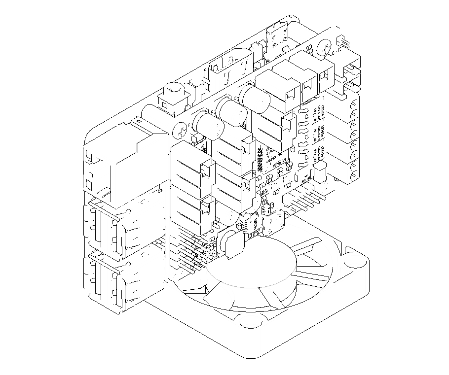

# Cooling options

Keeping the printHAT 2 cool during operations allows for more reliable print runs, increased performance of the electronics and ultimately longer life of the control board.  

Properly dissipating the heat is even more critical when the printHAT 2 is coupled to a Rasperry Pi 4 since that board runs particularly hot and its heat adds up to the one of the printHAT 2, mostly dominated by the stepper drivers load.

Depending on the performance requirements and the installation constraints on your machine, you can choose one of the options described in the next sections.  
The table provides the suggested cooling option based on the configured stepper motor running current.

| | Convection  | Heatsinks | Heatsinks + Forced cooling |
| :------------------------- | :-------------------------:|:-------:|:-------:|
| **RPi 4**| up to **0.8A** | up to **0.8A** | above **0.8A** |
| **RPi Zero, 2, 3** | up to **1.0A** | up to **1.0A** | above **1.0A** |

## Natural convection
Natural convection is an effective way of cooling the board, especially on machines that do not require high motor currents like small machines and low acceleration ones.

It is recommended to install the board vertically, with one of the longer sides facing down (Fig.1). In this configuration the two faces of the board will get the best cooling possible, since the warm air can move upwards on both of them (on a board laying flat the bottom side is poorly cooled instead).

*Fig.1 - printHAT 2 and Raspberry Pi standing vertical on one of the long side, the preferred orientation for natural cooling*

## Heatsinks
The installation of the heatsinks provided with the board can improve the cooling of some fan-less setups.

Since the installation once more relies on natural convection the same considerations on board orientation apply here.  

The heatsinks shall be installed with their fins and channels oriented vertically to facilitate the upwards flow of the hot air, and improve cooling.

> **IMPORTANT**  
> The heatsinks must be positioned properly to prevent mechanical interference when installing the printHAT 2 on a Raspberry Pi 3 or 4:  
- Make sure that the **bottom row is installed close to the row above** and further away from the board edge.  
- Make sure that all the **heatsinks fully cover their cooling pads** on the board.  

## Forced cooling
The most effective cooling is achieved using heatsinks and a fan to force the airflow in-between the printHAT 2 and the Raspberry Pi.
The airflow will carry away most of the heat right from where it is generated, which is in the area under the stepper drivers on the bottom side of the board.

The orientation of the board is less critical with forced cooling than with convection only, however it's always better to install the board vertically, as already described above.

The fan shall be installed so that the flow direction is upwards.  

*Fig.3 - Fan installed below the printHAT 2 and Raspberry Pi stack, pushing cool air up onto the boards*
