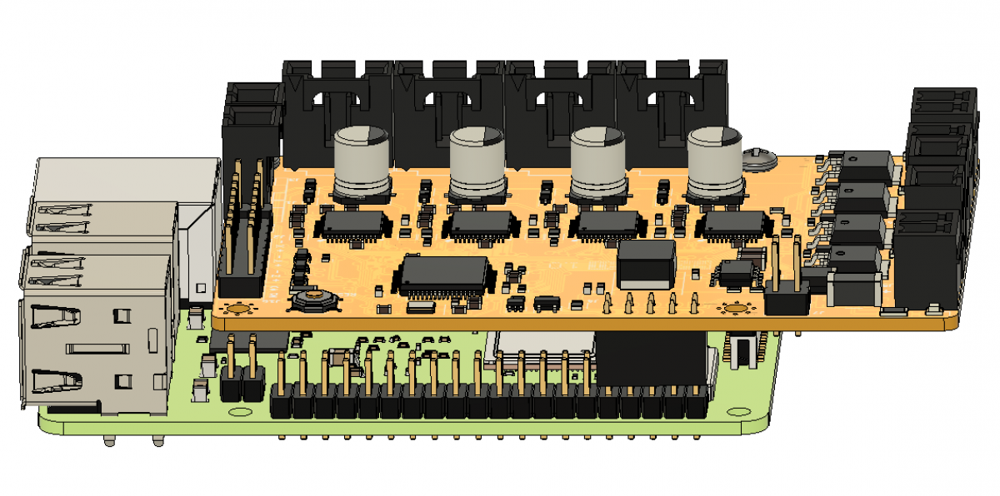
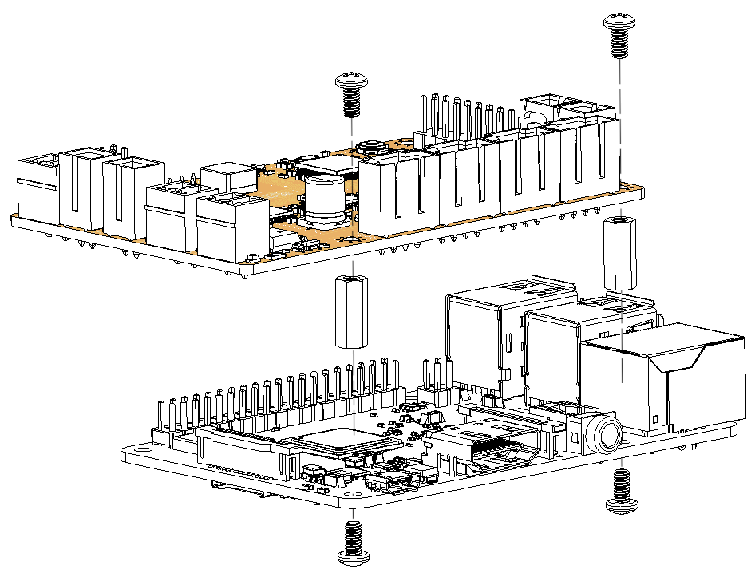
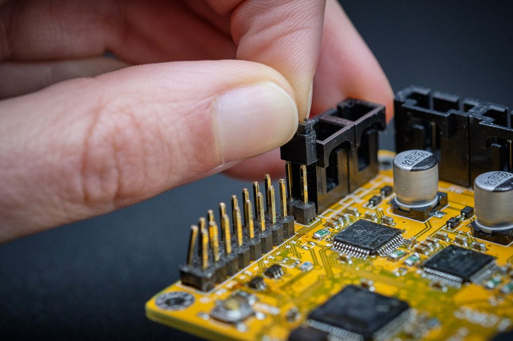

## Initialization of the board

During the first boot the wrecklabOS image takes care of installing all the required software. Connect the printHAT 2 to the Raspberry Pi following the procedure:

1. Install the board making sure the printHAT 2 connector is aligned with the right end of the Raspberry Pi header (Fig.1)
2. Mount the 2 spacers on the opposite side with respect to the Raspberry Pi header connector (Fig.2)
3. Make sure the boot jumper is installed (factory default on a brand new printHAT 2) (Fig.3)
4. Power the Raspberry Pi via the Micro USB port with a suitable [power supply](https://www.raspberrypi.org/documentation/hardware/raspberrypi/power/README.md){:target="_blank"}
5. As soon as the Raspberry Pi power LED turns on, remove the printHAT 2 boot jumper
6. The initialization will last few minutes taking care of the updates, if necessary, and of the rebooting at the end

In a short while you should be able to [connect to the Raspberry Pi](network)

*Fig.1 - printHAT 1 and Raspberry Pi stack alignment*

*Fig.2 - printHAT 1 spacers installation*

*Fig.3 - printHAT 1 boot jumper location*
