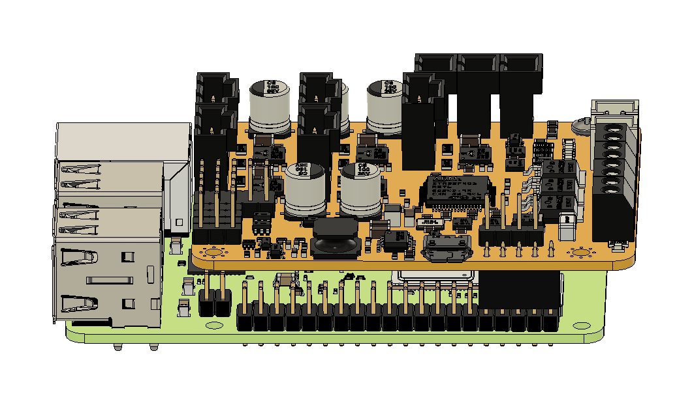
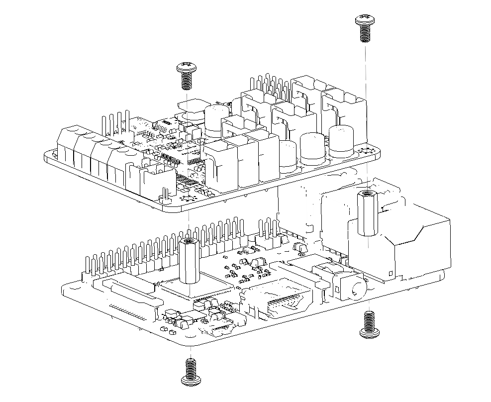
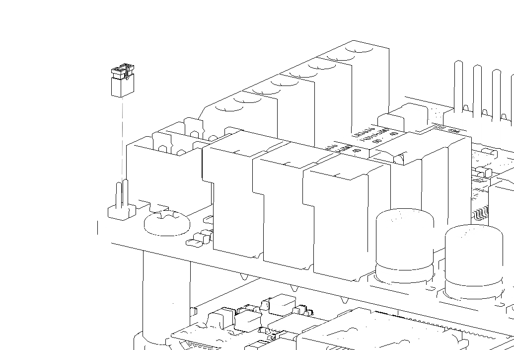

In this part you will assemble the printHAT 2 and the Raspberry and run the wrecklabOS for the first time. During the first boot the wrecklabOS image takes care of installing and/or updating all the required software.

> **NOTE**  
You don't need your 3D printer just yet. The following steps can be performed with the boards assembled on your desk.

## Initialization of the board

Connect the printHAT 2 to the Raspberry Pi with the following steps:

1. Install the board making sure the printHAT 2 connector is aligned with the right end of the Raspberry Pi header (Fig.1)
2. Mount the 2 spacers on the opposite side with respect to the Raspberry Pi header connector (Fig.2)
3. Make sure the boot jumper is installed (factory default on a brand new printHAT 2) (Fig.3)
4. Power the Raspberry Pi via the Micro USB port with a suitable [power supply](https://www.raspberrypi.org/documentation/hardware/raspberrypi/power/README.md){:target="_blank"}

> **IMORTANT**  
As soon as the Raspberry Pi power LED turns on, remove the printHAT 2 boot jumper

The initialization will continue in the background, lasting few minutes and taking care of all the software updates. In a short while you should be able to [connect to the Raspberry Pi](network)

> **IMORTANT**  
On the Raspberry Pi Zero the initialization process is very slow due to the reduced processing power of the board. Wait at least 5 minutes before continuing, to make sure the procedure is complete.

*Fig.1 - printHAT 2 and Raspberry Pi stack alignment*

*Fig.2 - printHAT 2 spacers installation*

*Fig.3 - printHAT 2 boot jumper location*
