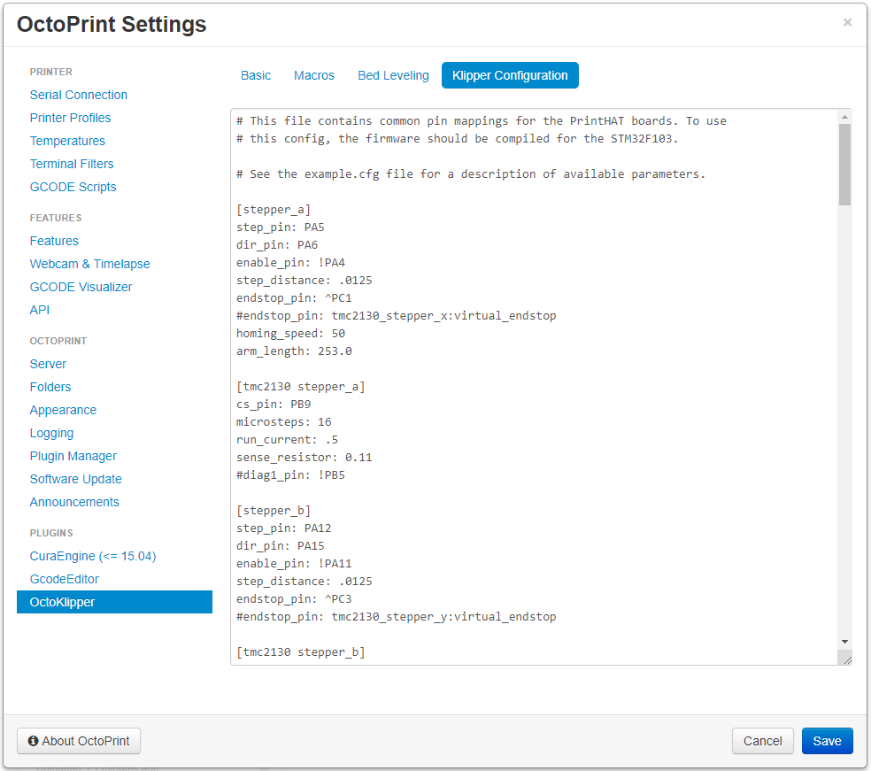

Klipper comes pre-configured for a generic cartesian printer and must be adjusted to match your particular machine. The configuration file can be easily edited via the OctoPrint interface:

- connect to OctoPrint via [http://wrecklab.local/](http://wrecklab.local/){:target="_blank"}
- click the Settings button
- click on the “OctoKlipper” plugin
- click on the “Klipper Configuration” Tab

> **NOTE**  
The “printer.cfg” file, where the configuration parameters are stored, can be edited line by line and/or copy/paste the content of one of the [available templates](https://github.com/wreck-lab/wrecklabOS/tree/devel/src/modules/klipper/filesystem/home/pi/klipper_config/config){:target="_blank"}.





## Printer type
Some sections of the configuration file are specific to your 3D printer architecture and they are described in the [Configure printer](printer) section. Follow the link to the one that matches your printer type.  

## Extruder
The extruder section contains also some basic parameters to be configured:

- **step_distance**: defines the length in mm of a single step. If you are unsure check the Klipper FAQ
- **nozzle_diameter**: Diameter of the nozzle orifice (in mm)
- **filament_diameter**: The nominal diameter of the raw filament (in mm) as it enters the extruder
- **sensor_type**: Type of sensor, this may be “EPCOS 100K B57560G104F”, “ATC Semitec 104GT-2”, “NTC 100K beta 3950”, “Honeywell 100K 135-104LAG-J01”, “NTC 100K MGB18-104F39050L32”, “AD595”, “PT100″, INA826”, “MAX6675”, “MAX31855”, “MAX31856”, or “MAX31865”

```py
[extruder]
step_distance: .0022
nozzle_diameter: 0.400
filament_diameter: 1.750
sensor_type: ATC Semitec 104GT-2
```

## Heated Bed (optional)
 If your machine has a heated bed, then the following section should be added to your configuration file. Make sure the sensor type matches the temperature sensor you have on your bed.

``` py
[heater_bed]
heater_pin: PC2
sensor_type: ATC Semitec 104GT-2
sensor_pin: PB0
pullup_resistor: 10000
control: watermark
min_temp: 0
max_temp: 120
```
