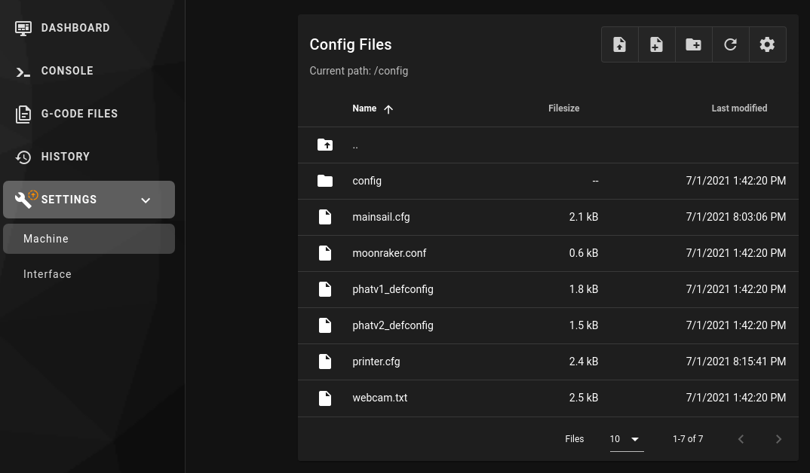
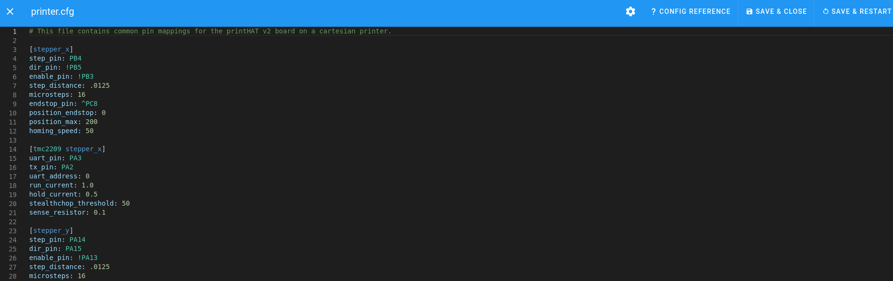

## Mainsail Settings
Mainsail configuration is almost ready to go out of the box. However, few little parts still need to be filled in since they describe your particular machine and can't be general (this is confirmed by the fact that the Mainsail dashboard is either not fully populated or displays error messages).  

To finalize the configuration, click the Setting button on the left panel and then click on the printer.cfg file in the file browser to edit it. Refer to the [printer configuration](printer){:target="_blank"} section for a list of changes typically needed by your printer architecture.

   

   
