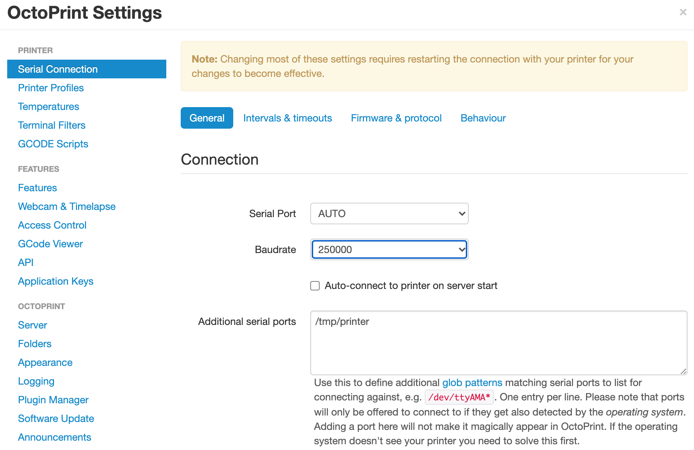
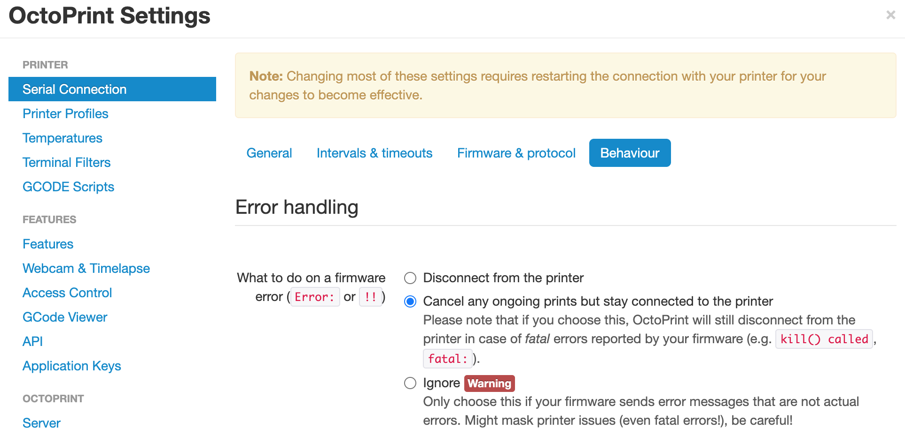

## OctoPrint Wizard
Upon first connection the OctoPrint Wizard will guide you through the required steps, including the configuration of your printer profile.  

Once you've completed the wizard, make sure also to apply the settings for [baudrate](#baudrate) and [error behaviour](#error) described below, before continuing with the [Klipper configuration](klipper).

## Baudrate
It might happen that during the first boot OctoPrint fails to detect the correct port speed, hence fails to connect. Before connecting make sure to select manually the baudrate of 250000.

## Error behavior
In case of any error OctoPrint default behaviour is to disconnect from the printer. This setting can cause a deadlock when the Klipper firmware goes into shutdown due to configuration errors or, for example, bad thermistor connection (i.e. ADC out of range). The shutdown state cannot be cleared because the FIRMARE RESTART button is not active when disconnected.
To avoid the deadlock go into **Settings > Serial Connection > Behaviour > Error Handling** and set it to **Cancel any ongoing prints but stay connected**

