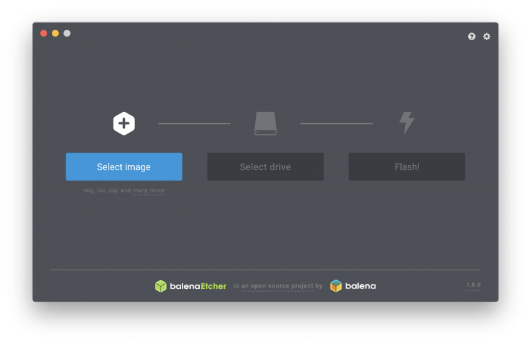

Let's start with a list of things you need:

- printHAT 2 control board
- Raspberry Pi 0/1/2/3/4 (RPi 2/3/4 are recommended for a smooth user experience)
- micro SD card (8GB or more)
- wrecklabOS software package

> **IMPORTANT**  
On **Raspberry Pi 4** we strongly recommend you use forced air cooling to cool both the Pi and the printHAT 2.

## Let’s Get Started
Download the wrecklabOS image (wrecklabOS-xxx.zip file) from the [official repository](https://github.com/wreck-lab/wrecklabOS/releases){:target="_blank"} and use [Etcher](https://www.balena.io/etcher/){:target="_blank"} to flash the .img file onto the the SD card as recommended in the Raspberry Pi [official documentation](https://www.raspberrypi.org/documentation/installation/installing-images/){:target="_blank"}. In short:

1. Download Etcher and install it
2. Insert your SD card
3. Open Etcher and select from your hard drive the wrecklabOS .img file you want to write onto the SD card
4. Select your SD card
5. Review your selections and click ‘Flash!’

