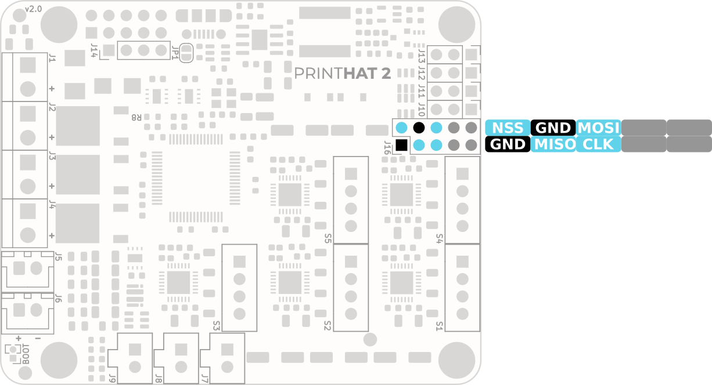

## SPI port connections
The printHAT V2 exposes one of the STM32 microcontroller SPI port. The SPI pins are made available on the J16 connector according to the pinout shown in the picture below.

Such SPI is typically used by expansion boards that provide some sort of extra functionality, for example:

- MAX6675 thermocouple amplifier [breakout board](https://www.electrodragon.com/product/max6675-breakout-board-for-thermocouple-genius-ic/)
- MAX31855 thermocouple amplifier [breakout board](https://www.adafruit.com/product/269)
